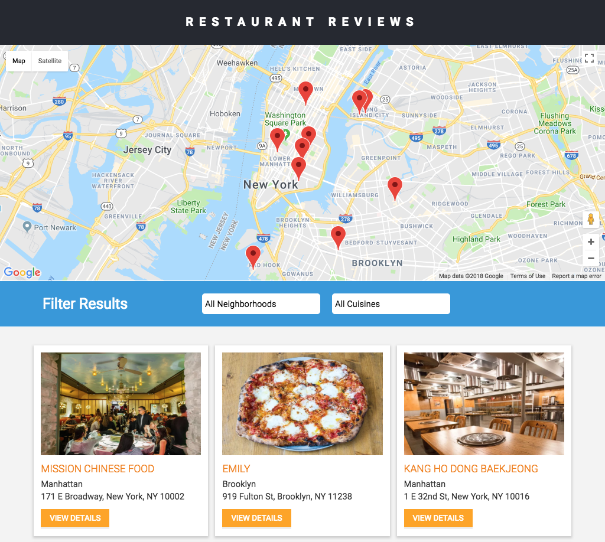

# Mobile Web Specialist Certification Course

## Restaurant Reviews_Stage 2



1. Retrieve Data: The Restaurant Review projects incrementally convert a static web page to a mobile-ready web application. We take the responsive design we built in Stage One and connect it to an external server and retrieving data by using `fetch ()` instead of local memory.

2. Service Worker: Use IndexedDB to store JSON data and Cache to store URL addressable resources, for example HTML, CSS, and JS files to maintain offline use with the development server. Any page (including images) that has been visited by the user is available offline, with data pulled from the shell database.

3. Responsive: This project is a fully responsive that all pages elements are usable and visible in any devices, including desktop, tablet, and mobile display.

4. Accessible: Use the appropriate semantic elements. Appropriate ARIA roles are defined for those elements in which a semantic element is not available.

## How to start the server

Refer to https://github.com/udacity/mws-restaurant-stage-2

## How to start the app

1. Clone the project into your local

```
git@github.com:romklao/mws-restaurant-stage-2-update.git
```

2. Install glup

```
npm install gulp-cli -g
```

3. Install project dependencies

```
npm install
```

4. Build your app to `dist` directory

```
gulp dist
```

5. Serve the web app

```
gulp
```


